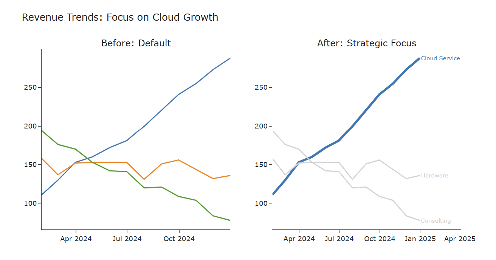
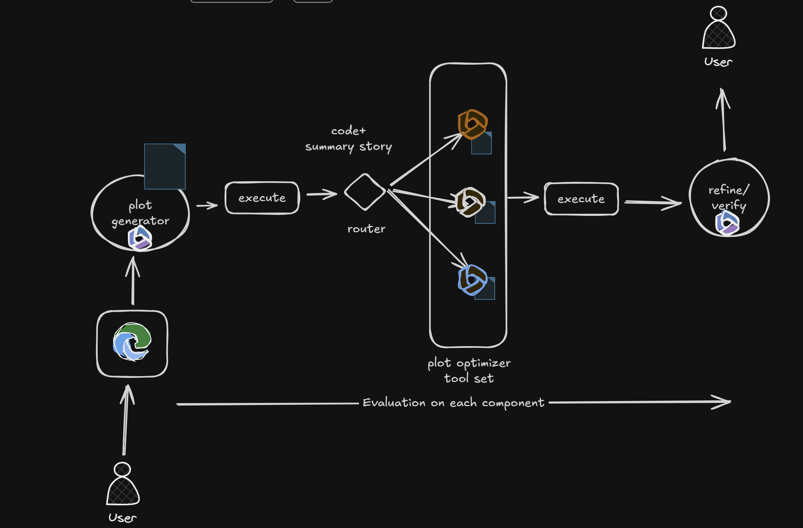
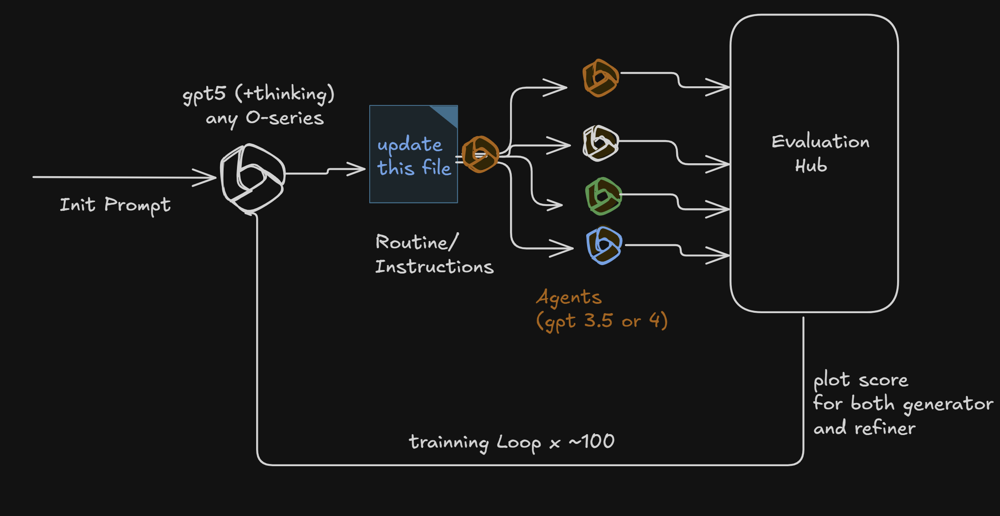

# Story-Driven Visualization Agent

An AI agent that turns raw charts into story-driven visualizations.

Instead of just generating Plotly code, the agent understands what you're trying to say with your data and reshapes the chart to make that message clear—following principles from:
- [Storytelling with Data](https://www.storytellingwithdata.com/chart-guide)

**The goal:** Not "draw a chart," but "tell a story with data."

---

## What It Does

You give the agent:
- A dataset
- A natural-language request (e.g., "Show revenue trends and highlight Cloud services")
- Multi-turn conversation between the user and the agent to improve the plot

The agent:
- Interprets the intent
- Chooses an appropriate chart type or elicits for clarity from the user
- Applies storytelling rules (focus, contrast, ordering, labeling, color)
- Generates clean Plotly code

Instead of: *"Here is a line chart."*

You get: *"Here is a line chart that emphasizes the most important series, de-emphasizes noise, and guides the reader to the point."*

---

## Example

```python
from plotly_agent.workflow_orchestrator import WorkflowOrchestrator

orch = WorkflowOrchestrator()
orch.load_data("data.csv")

response = orch.chat("Show revenue trends, highlighting Cloud Service")
print(response["code"])
```

The agent will:
- Highlight Cloud in color
- Fade less important lines
- Sort, label, and annotate for clarity
- Apply layout and design best practices



---

## Why This Exists

Most visualization tools treat charts as geometry. Humans read charts as stories.

This project bridges that gap by encoding:
- Emphasis vs background
- Comparison vs trend
- What deserves attention vs what should fade into context

---

## How It Works



The system uses a multi-agent pipeline:

```
User → Generator → Router → Optimizer → Verifier → User
```

Each agent has a role:
- One interprets what the user means
- One decides how the story should be told
- One writes the Plotly code
- One verifies best practices

The system supports multi-turn conversations—refine, change, or question the chart and the agent adapts.

---

## Instruction Prompt Optimization



Agent instructions are iteratively refined through an evaluation loop to improve output quality.

---

## What This Is (and Isn't)

**This is:**
- A research prototype for story-driven visualization
- A sandbox for AI + data storytelling experiments
- A tool for learning how narrative design can be encoded

**This is not:**
- A finished BI product
- A plotting wrapper
- A static chart generator

--- 

## Quick Start

1. **Clone the repo**
   ```bash
   git clone https://github.com/your-username/VIZAGENT.git
   cd VIZAGENT
   ```

2. **Install dependencies**
   ```bash
   pip install -r requirements.txt
   ```

3. **Set your OpenAI API key**
   ```bash
   export OPENAI_API_KEY='your-api-key'
   ```

4. **Run the web app**
   ```bash
   python web_app_workflow.py
   ```

5. **Open in browser**
   ```
   http://localhost:5000
   ```

6. **Upload a CSV and start chatting**
   - Upload your data file
   - Ask: "Show revenue trends, highlighting Cloud Service"
   - The agent generates story-driven Plotly code

---

## License

MIT — for research, experimentation, and learning.
