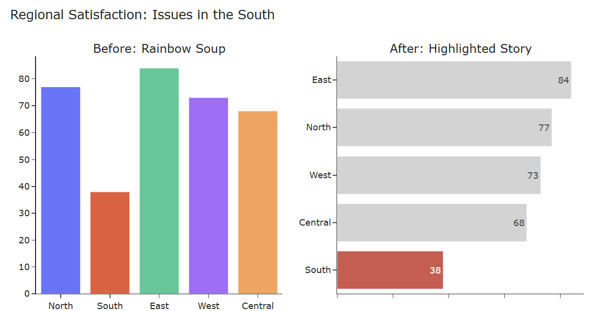
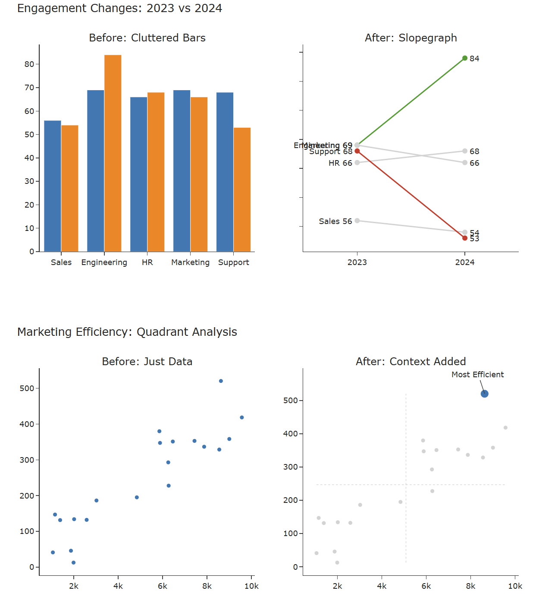

# Multi-Agent Plotly Code Generation System

A conversational AI system for generating Python Plotly visualization code through natural multi-turn dialogue. Built from scratch without external frameworks like LangGraph.

## NEW: Multi-Agent Workflow Pipeline (Recommended)

We've built a new specialized agent pipeline for higher quality visualizations:

```
User → Communication → Generator → Router → Optimizer → Verifier → User
```

**Pipeline Features:**
- ✅ Natural conversation with clarifications
- ✅ Story-driven visualization
- ✅ Chart-type specialists (Line/Bar/Scatter)
- ✅ Automatic best practices application
- ✅ Built-in verification

### What the Agent Produces

The agent transforms basic plots into polished, story-driven visualizations following data storytelling best practices. See the [Artifacts/](Artifacts/) folder for before/after examples:

#### Line Charts - Revenue Trends


**Before:** Default multi-colored lines with legend
**After:** Strategic focus with Cloud Service highlighted in blue, context lines in grey, direct labeling

#### Bar Charts - Regional Comparisons


**Before:** Vertical bars with rainbow colors
**After:** Horizontal sorted bars with problem area (South) highlighted in red, data labels

#### Scatter Plots & Advanced Charts


**Slopegraph Before:** Cluttered grouped bars
**Slopegraph After:** Clean lines showing changes (green=improvement, red=decline)

**Scatter Before:** Plain data points
**Scatter After:** Quadrant analysis with reference lines, best performer highlighted

**Quick Start with New Workflow:**
```python
from plotly_agent.workflow_orchestrator import WorkflowOrchestrator

orch = WorkflowOrchestrator()
orch.load_data('data.csv')
response = orch.chat("Show me revenue trends, highlighting Cloud Service")
print(response['code'])
```

📚 **See**: [WORKFLOW_QUICKSTART.md](WORKFLOW_QUICKSTART.md) | [WORKFLOW_ARCHITECTURE.md](WORKFLOW_ARCHITECTURE.md)

---

## Original Architecture: Reflection Pattern

The original system uses a reflection pattern with these agents:

- **Orchestrator Agent**: Routes requests, detects ambiguity, asks clarifying questions
- **Planner Agent**: Analyzes data and creates visualization specifications using chain-of-thought reasoning
- **Coder Agent**: Translates specifications into clean Python Plotly code
- **Critic Agent**: Validates code quality and suggests improvements

**Key Features:**
- ✅ Multi-turn conversations with context retention
- ✅ Memory management (session, episodic, user preferences)
- ✅ RAG-based knowledge retrieval for Plotly documentation
- ✅ Ambiguity detection with clarifying questions
- ✅ Pydantic-based tool calling for data analysis
- ✅ Chain-of-thought reasoning for transparency
- ✅ Returns code and text only (no figure execution)

📚 **See**: [WORKFLOW_COMPARISON.md](WORKFLOW_COMPARISON.md) for architecture comparison

---

## Quick Start

### Installation

```bash
# Install dependencies
pip install -r requirements_plotly_agent.txt

# Set your OpenAI API key
export OPENAI_API_KEY='your-api-key-here'
```

### Basic Usage

```python
from plotly_agent.main import PlotlyAgent
import pandas as pd

# Initialize agent
agent = PlotlyAgent()

# Load your data
df = pd.read_csv("your_data.csv")
agent.load_data(df)

# Generate visualization code
response = agent.chat("Create a scatter plot of price vs quantity colored by category")

# Get the code
print(response.code)
print(f"Quality Score: {response.data['quality_score']}")
```

### Multi-Turn Conversation

```python
# Initial request
r1 = agent.chat("Show me sales trends over time")
print(r1.code)

# Refine
r2 = agent.chat("Make it a bar chart instead and color by region")
print(r2.code)

# Get explanation
r3 = agent.chat("Why did you choose those axes?")
print(r3.content)
```

---

## System Architecture

```
User Input
    ↓
┌──────────────────────────────────────────────┐
│     Conversation Manager                      │
│  • Session orchestration                     │
│  • Multi-turn coordination                   │
│  • Memory management                         │
└──────────────────────────────────────────────┘
    ↓
┌──────────────────────────────────────────────┐
│  Memory + Knowledge Base                      │
│  • Recent messages (full context)            │
│  • Episodic memory (compressed history)      │
│  • User preferences (learned over time)      │
│  • Vector search for Plotly knowledge        │
└──────────────────────────────────────────────┘
    ↓
┌──────────┬───────────┬──────────┬────────────┐
│Orchestr  │  Planner  │  Coder   │  Critic    │
│  • Route │  • CoT    │  • Code  │  • Validate│
│  • Ambig │  • Spec   │  • Clean │  • Quality │
└──────────┴───────────┴──────────┴────────────┘
    ↓
Code + Metadata
```

---

## Core Components

### 1. Memory System

**Session Memory** - Recent conversation turns (last 10 messages)
```python
summary = agent.get_session_summary()
print(summary['total_messages'])
print(summary['preferred_charts'])
```

**Episodic Memory** - Compressed older conversations
- Automatically created when conversation exceeds threshold
- Preserves key facts and user corrections

**User Profile** - Learned preferences
- Preferred chart types
- Technical level
- Past corrections

### 2. Ambiguity Detection

The system proactively detects unclear requests:

```python
# Ambiguous request
response = agent.chat("make something nice")

# Agent asks for clarification
if response.type == "clarification":
    for question in response.questions:
        print(question.text)
        print(question.options)
```

**Detects:**
- Missing data source
- No chart type specified
- Vague language ("nice", "good", "better")
- Too brief requests
- Conflicting requirements

### 3. Knowledge Retrieval (RAG)

Load custom domain knowledge:

```python
agent.load_knowledge("plotly_advanced_guide.txt")
```

**Pipeline:**
1. Embed user query
2. Search knowledge base (cosine similarity)
3. Rerank by conversation relevance
4. Inject top-K into prompts

**Knowledge Format:**
```markdown
# Scatter Plots

Use scatter plots for two continuous variables.

## Example
```python
import plotly.express as px
fig = px.scatter(df, x='col1', y='col2', color='category')
```

## Best Practices
- Use color for categories
- Add trendlines with trendline='ols'
```

### 4. Tool Calling

Structured data analysis with Pydantic:

**Available Tools:**
- `data_summary` - Column statistics
- `column_search` - Find columns by name/type/values
- `analyze_data` - Correlation, distribution, outliers, missing data
- `validate_code` - Syntax checking

### 5. Chain-of-Thought Reasoning

Agents explain their decisions:

```python
response = agent.chat("Visualize relationship between A and B")

# Access reasoning
spec = response.data['specification']
print(spec['reasoning'])
# "Chose scatter plot because exploring relationship between
#  two continuous variables..."

print(spec['alternatives'])
# ["line chart if data is sequential", "box plot for distributions"]
```

---

## API Reference

### PlotlyAgent

Main interface:

```python
PlotlyAgent(
    api_key: Optional[str] = None,  # Or set OPENAI_API_KEY env var
    model: str = "gpt-4o-mini",
    knowledge_file: Optional[str] = None,
    use_default_knowledge: bool = True
)
```

**Methods:**
- `load_data(data: str | pd.DataFrame)` - Load CSV or DataFrame
- `chat(message: str) -> Response` - Send message, get response
- `load_knowledge(filepath: str)` - Add custom knowledge
- `get_session_summary() -> dict` - Session statistics
- `new_session()` - Start fresh conversation
- `export_code(filepath: str)` - Save generated code

### Response Object

```python
class Response:
    type: "plan" | "success" | "error" | "clarification" | "info"
    content: str                    # Human-readable message
    code: Optional[str]             # Generated Python code
    data: Optional[Dict]            # Metadata (quality_score, chart_type, etc.)
    questions: List[Question]       # Clarification questions
    suggestions: List[str]          # Improvement suggestions
    awaiting_confirmation: bool     # Waiting for user input
```

---

## Design Decisions

### Why 4 Specialized Agents?

**Trade-off:** More orchestration complexity vs clearer reasoning

**Benefits:**
- Easier debugging (isolate failures to specific agents)
- Role-specific prompt optimization
- Parallel development
- Better evaluation

### Why Spec-First Approach?

Plan → Specification → Code instead of direct generation

**Benefits:**
- User can confirm intent before code generation
- Systematic iteration
- Separates "what to visualize" from "how to code it"

### Why RAG for Knowledge?

**Trade-off:** Requires embeddings API vs direct prompting

**Benefits:**
- Users don't need exact Plotly terminology
- Semantic search is more forgiving
- Scalable to large documentation

### Why No Code Execution?

**Trade-off:** Can't verify plot appearance vs safer & faster

**Benefits:**
- No security concerns
- Faster response times
- User executes code in their own environment
- Focus on code quality over rendering

---

## Example Scenarios

### Scenario 1: Simple Visualization

```python
agent.load_data("sales.csv")
response = agent.chat("scatter plot of price vs quantity")
```

**Flow:**
1. Orchestrator: Not ambiguous → route to Planner
2. Planner: Creates spec for scatter, x=price, y=quantity
3. Coder: Generates `px.scatter(df, x='price', y='quantity')`
4. Critic: Validates syntax and quality
5. **Returns:** Success with code

### Scenario 2: Ambiguous Request

```python
response = agent.chat("make a nice plot")
```

**Flow:**
1. Orchestrator: Detects ambiguity (vague terms, no chart type)
2. **Returns:** Clarification questions
   - "What type of chart?"
   - "Which columns to visualize?"

### Scenario 3: Iterative Refinement

```python
r1 = agent.chat("line chart of sales over time")
# Returns: px.line(df, x='date', y='sales')

r2 = agent.chat("color it by region")
# Modifies spec to add color='region'
# Returns: px.line(df, x='date', y='sales', color='region')

r3 = agent.chat("make it a bar chart")
# Changes chart_type
# Returns: px.bar(df, x='date', y='sales', color='region')
```

### Scenario 4: Custom Knowledge

```python
# Load domain-specific guide
agent.load_knowledge("financial_plotting.txt")

response = agent.chat("create a candlestick chart")
# Retrieves candlestick knowledge from custom file
# Generates domain-specific code
```

---

## Project Structure

```
plotly_agent/
├── __init__.py
├── models.py           # Pydantic models for all data structures
├── memory.py           # Session & episodic memory management
├── knowledge.py        # RAG system with vector search
├── tools.py            # Data analysis & validation tools
├── agents.py           # Orchestrator, Planner, Coder, Critic
├── conversation.py     # Multi-turn conversation manager
└── main.py             # Main PlotlyAgent interface

example_usage.py        # Example scenarios
plotly_agent_app.py     # Flask web interface (optional)
requirements_plotly_agent.txt
```

---

## Advanced Features

### Custom Agent Behavior

```python
# Adjust ambiguity sensitivity in plotly_agent/agents.py
# OrchestratorAgent._detect_ambiguity()
# Lower threshold = fewer clarification questions
```

### Session Management

```python
# Export session for later
summary = agent.get_session_summary()

# Start fresh session
agent.new_session()
```

### Knowledge Base Customization

```python
from plotly_agent.knowledge import KnowledgeBase

kb = KnowledgeBase(api_key="your_key")
kb.load_from_directory("docs/", pattern="*.md")
kb.embed_documents()

agent = PlotlyAgent(api_key="your_key", use_default_knowledge=False)
agent.knowledge_base = kb
```

---

## Performance

**Token Usage per Request:**
- Simple plot: ~1,500 tokens
- Complex plot: ~3,000 tokens
- With full context: ~5,000 tokens

**Latencies:**
- Orchestrator: 0.5-1s
- Planner: 2-3s
- Coder: 1-2s
- Critic: 1-2s
- **Total: 5-8 seconds**

**Optimization:**
- Use `gpt-4o-mini` (10x cheaper than GPT-4)
- Cache knowledge base embeddings
- Limit context window size

---

## Troubleshooting

**"No data loaded"**
```python
# Load data first
agent.load_data("your_data.csv")
```

**Low quality scores**
- Provide more specific requests
- Add domain knowledge files
- Check data quality and column names

**Ambiguity detection too sensitive**
```python
# Adjust in agents.py OrchestratorAgent._detect_ambiguity()
```

**Out of context window**
```python
# Start new session
agent.new_session()
```

---

## Contributing

This system was built for educational purposes to explore multi-agent architectures. Key principles:

- **No external frameworks** - Custom implementation
- **Transparency** - Chain-of-thought reasoning
- **Modularity** - Clear separation of concerns
- **Evaluation** - Quality metrics at every step

---

## Requirements

Core:
- Python 3.9+
- openai >= 1.51.0
- pandas >= 2.2.0
- plotly >= 5.24.0
- pydantic >= 2.9.0

See [requirements_plotly_agent.txt](requirements_plotly_agent.txt) for full list.

---

## License

MIT License - Educational and research purposes.

## References

- OpenAI Cookbook: Multi-agent patterns
- smolagents: Agent orchestration principles
- Plotly Documentation: Visualization best practices

---

## Getting Help

- See [AGENT_DESIGN.md](AGENT_DESIGN.md) for architecture details
- Review [example_usage.py](example_usage.py) for scenarios
- Check agent prompts in [plotly_agent/agents.py](plotly_agent/agents.py)

---

**Built with:** Custom multi-agent architecture • OpenAI GPT-4 • Pydantic • RAG • Chain-of-Thought reasoning
